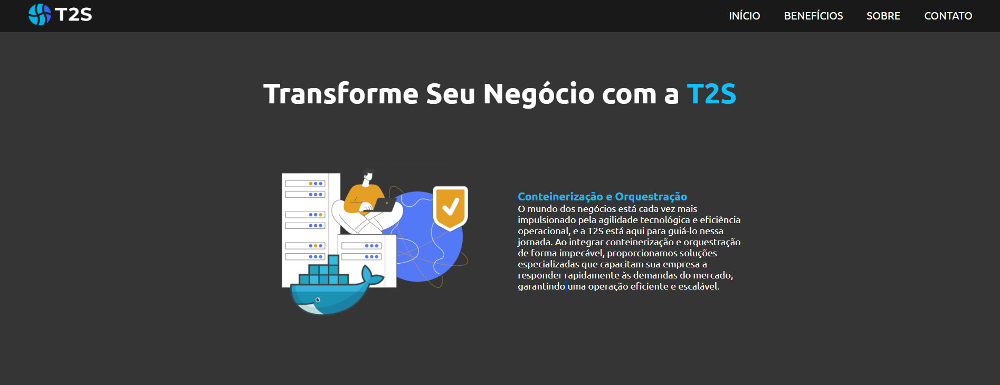
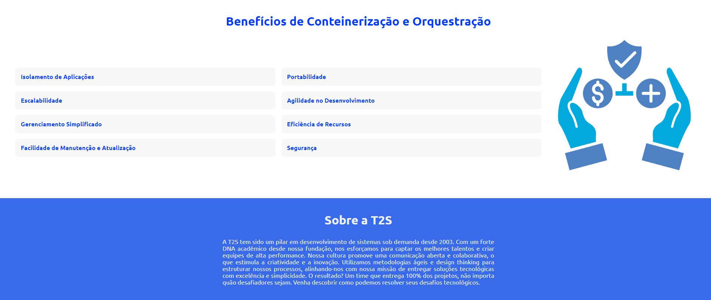
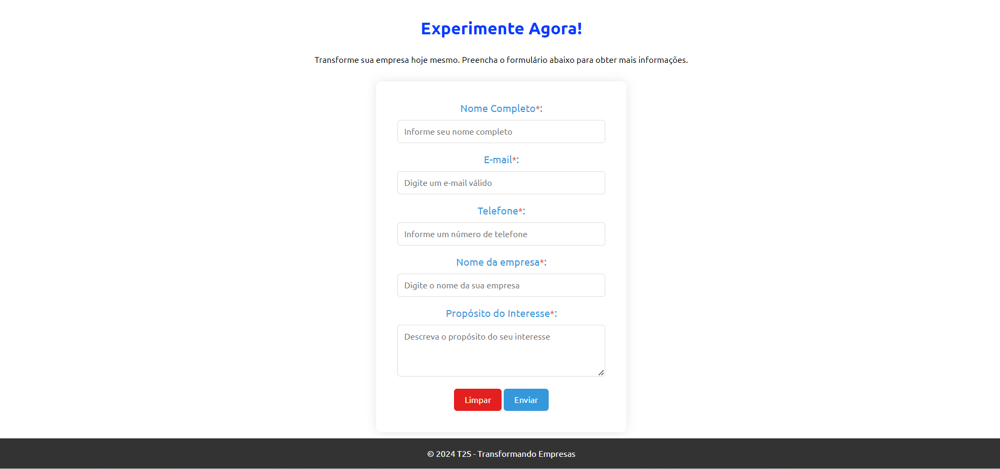

  

<h1 align="center">🚀 Landing Page - Serviço T2S 🌐</h1>

  
  
  

</img>
</img>
</img>

---

## 📖 Sobre

Este projeto consiste em uma landing page para um serviço da empresa T2S. A página foi desenvolvida utilizando HTML, CSS e JavaScript, e possui uma série de funcionalidades interativas. Alem de possuir um formulário de registro de leads implementado do Google Forms, e também registrar os dados em uma planilha do Google Sheets.

## ✔️ Objetivos

- Desenvolver uma landing page atraente e informativa para apresentar os serviços da T2S.
- Incorporar um formulário de registro de leads usando o Google Forms para capturar informações.
- Implementar funcionalidades interativas, como validação de formulário e animações, usando JavaScript.
- Verificar a funcionalidade do formulário, a responsividade da página e a integração com o Google Sheets.
- Coletar feedback dos usuários e realizar alterações no projeto conforme necessário.

## 🎯 Funcionalidades

- Apresentação dos benefícios da conteinerização e orquestração.
- Formulário de contato para os usuários interessados no serviço.
- Validação de formulário em tempo real com feedback ao usuário.
- Animacões e transições para melhorar a experiência do usuário.
- Responsividade para garantir uma boa visualização em diferentes dispositivos.

## 🔧 Instruções

1. Faça um clone deste repositório para o seu ambiente local
(`git clone https://github.com/MurilloLS/desafiot2s.git`).
2. Abra a landing page em seu navegador da web(`https://murillols.github.io/desafiot2s/`).
3. Explore a landing page e preencha o formulário de contato para enviar uma mensagem.
4. Interaja com as animações e observe a validação em tempo real do formulário.

## 🤝 Contribuição

Contribuições são bem-vindas! Para contribuir com este projeto, siga estas etapas:

1. Faça um fork do repositório.
2. Crie uma nova branch (`git checkout -b feature/sua-feature`).
3. Faça commit das suas alterações (`git commit -am 'Adiciona nova funcionalidade'`).
4. Faça push para a branch (`git push origin feature/sua-feature`).
5. Abra um pull request.

Por favor, certifique-se de atualizar os testes conforme apropriado.

---
Feito com ☕ e ❤️ por [Murillo](https://github.com/MurilloLS)

